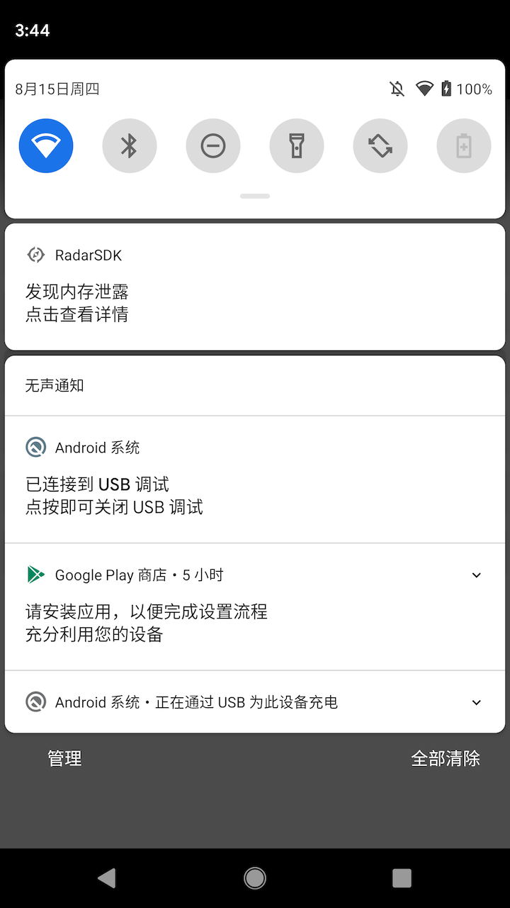
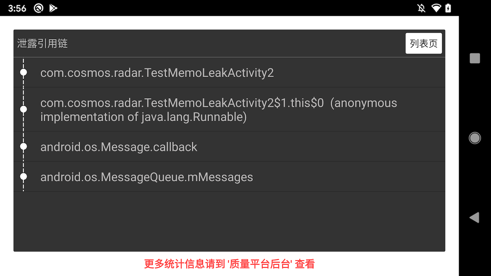
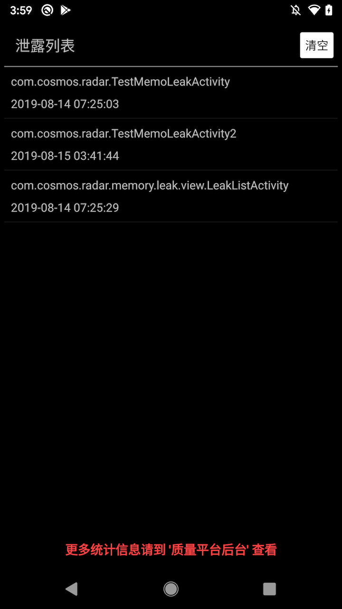
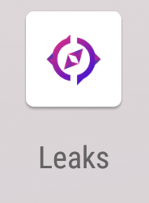

# Android SDK 使用指南

- Radar接入到客户端之后，是否打开采集性能数据功能，需要配合后台放量配置。
- 因为对SDK本身对CPU、内存有一定的消耗，建议业务在试用期间尽量避免全量上，通过放量能够排查问题即可
- 每一项指标具体的阈值都可以通过后台进行配置，建议业务根据自身应用程序的现状进行配置

---

## 集成SDK

### 添加仓库地址
Radar支持JCenter仓库

### 集成依赖
```
dependencies {
    implementation "com.cosmos.radar:core:2.2.3"
}
```

### 混淆设置
为避免混淆报错，在Proguard混淆文件中增加以下配置：

```
# 内存泄露检测库
-keep class squareup.haha.** {*;}
-keep class com.squareup.haha.** {*;}
-dontwarn com.squareup.haha.**

# radar相关
-dontwarn com.cosmos.radar.**
-keep class com.cosmos.radar.**{*;}
```

## 集成Gradle插件
如果应用有经过`proguard`混淆，为了方便查看堆栈信息，需要配置插件来提交`mapping`文件

### 添加插件依赖
在Project的build.gradle下面添加编译期依赖：

```
buildscript {
    dependencies {
        classpath 'com.cosmos.rifle:plugin:1.4.2'
    }
}
```

### 应用插件
在**`Application对应的Module里的build.gradle文件`**中应用插件：

```
apply plugin: 'rifle.plugin'
rifleConfig {
    appId = "4af037b83e77345j3443io5d8d67395"          // 管理后台申请的应用APPID
    appKey = "e843359357823432hkj37b715e68cf6"         // 管理后台申请的应用APPKEY
    versionName = android.defaultConfig.versionName     // 当前应用的版本名称
}
```

## 初始化

在Application的onCreate方法中，加入如下代码初始化Radar

```
RadarConfig.Builder builder =
        new RadarConfig.Builder(this, "后台申请的APPID")
                .kits(
                		new ANRKit(),                    // ANR
                        new LagKit(),                    // 卡顿
                        new PageLaunchTimeKit(),         // 页面启动时间
                        new MemoryLeakKit(),             // 内存泄露
                        new MemoryAlertKit()             // 内存峰值报警
                );
Radar.with(builder.build());
```

## 更加丰富的配置
在初始化Radar的时候，需要通过`RadarConfig.Builder`来构建`RadarConfig`类对象，可以通过该build类的接口配置其他可选项

### 打开调试日志
打开调试日志之后，性能统计SDK在采集各项数据的时候在logcat会有日志输出

```
builder.printDebugLog(BuildConfig.DEBUG)
```

### 强制打开性能统计
性能统计是否打开，正常是通过后台放量开关进行放量配置，如果希望强制打开性能统计，可以通过以下接口打开

> ! ! ! ! 不建议线上强制打开，对性能有一定的影响! ! ! ! 

```
builder.forceTurnOn(BuildConfig.DEBUG)
```

### 客户端内存泄露及时通知

- 在客户端APP运行期间，检测内存泄露，并实时发送通知（Toast、通知栏）
- 通过点击通知栏通知，能够进入内存泄露引用链查看界面

> ! ! ! ! 不建议线上打开，影响用户使用! ! ! ! 

```
builder.analyzeLeakForeground(BuildConfig.DEBUG)
```

通知栏效果


内存泄露引用链详情页


内存泄露列表页


泄露历史记录桌面图标


### 设置版本名称
该项为可选项，如果不设置，将会取`build.gradle`中的`versionName`对应的值，当然你可以通过以下接口进行自定义：

```
builder.appVersionName("1.0.0")
```

### 设置版本号
该项为可选项，如果不设置，将会取`build.gradle`中的`versionCode`对应的值，当然你可以通过以下接口进行自定义：

```
builder.appVersionCode(6666)
```

### 设置用户ID
通过设置用户ID能够方便后期对问题的追踪

```
builder.userId("32682487")
```

### 设置渠道号
通过设置渠道号能够方便后期对问题的追踪

```
builder.channel("yingyongbao")
```

### 修改页面名称获取方式
目前Radar内部在记录，需要获取页面（Activity）的名称，默认获取方式为获取页面的类名。
该方式的缺点是，如果业务有部分web页面，Activity都是同一个类，但是内容（URL）不一样，需要重写页面名称获取方式

```
builder.pageNameProvider(new IPageNameProvider() {
    @Override
    public String getPageName(Activity activity) {
        if (activity instanceof WebViewActivity) {
            return xxxx;
        }
        return null;
    }
})
```

### 修改Log输出实现
如果希望修改log打印是的tag等功能，可以通过

```
builder.logImpl(
    new ILog() {
        @Override
        public void v(String tag, String msg) {
            Log.v("Radar-SDK", msg);
        }

        @Override
        public void d(String tag, String msg) {
            Log.d("Radar-SDK", msg);
        }

        @Override
        public void i(String tag, String msg) {
            Log.i("Radar-SDK", msg);
        }

        @Override
        public void w(String tag, String msg) {
            Log.w("Radar-SDK", msg);
        }

        @Override
        public void e(String tag, String msg) {
            Log.e("Radar-SDK", msg);
        }

        @Override
        public void printError(String tag, Throwable throwable) {
            Log.e("Radar-SDK", Log.getStackTraceString(throwable));
        }
    })
```

## 更多功能
除了在初始化的时候，通过config文件进行配置外，在程序运行期间，还提供如下功能项
### 更新用户ID
程序运行期间，如果用户ID更换之后，可以通过API进行更新

```
Radar.setUserId("23748");
```

### 添加自定义属性

为了方便排查问题，可以通过添加自定义属性，添加的属性将会被带到后台，方便查看。

```
Radar.putUserKeyValue("diyAttribute", "ssss");
```

## 线上空实现
因为`Radar` SDK 对包大小有一定的影响，如果业务在部分渠道不希望将其带上，可以通过gradle引用空库，而不需要修改代码的方式来减少对包大小的影响：

```
dependencies {
    debugImplementation "com.cosmos.radar:core:2.2.3"
    releaseImplementation "com.cosmos.radar:empty:2.1.3"
}
```

